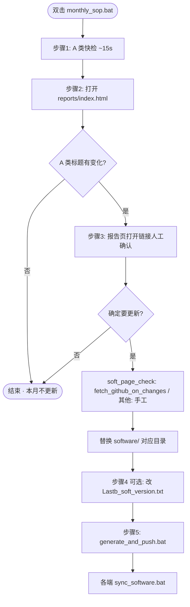

# soft_page_check — 软件页面快检

从仓库根目录 [`Lastb_soft_version.txt`](../Lastb_soft_version.txt)（**「最终选择指南」之前**）提取页面 URL，抓取网页 `<title>` 并与历史快照比对，快速发现「可能有新版本」的介绍页。

**不更新 `software/` 也完全可用**——本工具只做健康检查，不负责下载。破解 / 423down / 网盘类资源仍需手工下载后再替换目录并执行 [`generate_and_push.bat`](../generate_and_push.bat)。

> **月度更新入口**：双击 **[`monthly_sop.bat`](monthly_sop.bat)**，按步骤引导完成「快检 → 看报告 → 决定是否更新 → 发布」。

---

## 月度更新流程（SOP）

### 一句话

**每月跑一遍 SOP → 报告里 A 类无变化就收工；有变化再手工下包 → 替换 `software/` → `generate_and_push.bat` → 客户端 `sync_software`。**

### 流程图



### 分步说明

| 步骤 | 做什么 | 工具 / 路径 | 可跳过？ |
|------|--------|-------------|----------|
| **1 快检** | 抓 A 类 ~42 页标题，与上月快照比对 | `monthly_sop.bat` 或 `monthly_check.bat` | 否（或看旧报告） |
| **2 看报告** | 关注「A 类 · 同步软件」的**标题变化**数 | [`reports/index.html`](reports/index.html) | 否 |
| **3 决策** | 变化 = 0 → **直接结束**；有变化 → 点开链接确认 | 报告页「打开 / 依次打开变化页」 | 无变化必跳过后续 |
| **3 下载** | GitHub 变化 → `soft_page_check\fetch_github_on_changes.bat`；423down/破解 **浏览器手工** | 仅「要更新」时 |
| **3 替换** | 解压覆盖到 `software\子目录\` | 资源管理器 | 仅「要更新」时 |
| **4 文档** | 改装机区说明、可选 append digest 一行 | `Lastb_soft_version.txt` | 可选 |
| **5 发布** | 生成 `list.txt` 并 push | 根目录 `generate_and_push.bat` | 未改 software 则跳过 |
| **6 同步** | 各机器拉新版本 | `sync_software.bat` | 仅发布后 |

### 首次使用（快检）

**每个监控范围**（A / 全量 / 423down / 7xiazai / list 三站）都要 **连续跑两次** 才会出现「标题变化」：

| 范围 | 第一次 | 第二次 |
|------|--------|--------|
| A 类 | 建立基线，无 `changed_tier_a_urls.txt` | 有比对结果 |
| 全量 118 页 | 建立基线，无 `changed_pages_urls.txt` | 有比对结果 |
| 423down digest | 同上 | 同上 |
| 7xiazai 列表 | 同上 | 同上 |
| hybase / dayanzai / down66 | 同上 | 同上 |

控制台出现 **「首次运行该范围：已保存标题基线」** 时属于正常，不是报错。再跑一遍即可。

若第二次显示 **「无标题变化」** → 说明页面标题与上次一致，**不必更新** `software/`。

### 季度补充（非每月必须）

| 操作 | 频率 |
|------|------|
| `monthly_check_full.bat` — A + 装机 + 423down + 7xiazai + list 三站 | 约每季度（连跑两次） |
| `monthly_check_list.bat` — 仅 hybase + dayanzai + down66 | 约每季度（连跑两次） |

### SOP 主菜单说明

[`monthly_sop.bat`](monthly_sop.bat) 提供：

| 选项 | 用途 |
|------|------|
| **1 完整月度 SOP** | 带 5 步引导（推荐） |
| **2 仅 A 类快检** | 只要报告、不要问答 |
| **3 仅发布** | 已手工改好 `software/`，直接 push |
| **4 季度 423down** | digest 356 条全量比对 |
| **5 7xiazai 列表** | 首页 ~ `/page/65/` 列表页快检 |
| **6 打开报告页** | 刷新并打开 `index.html` |
| **7 list 三站** | hybase + dayanzai + down66（`monthly_check_list.bat`） |

---

## 日常快检（简版）

```
平时不做事（software/ 照用）        │
        ▼ 偶尔想瞄一眼（约 15 秒，A 类 42 页）
  monthly_check.bat
        │
        ├─ 无变化 → 结束，不用更
        │
        └─ 有变化 → open_report.bat（HTML 报告，可筛选 / 一键打开）
                    或 open_changed_pages.bat
                    │
                    ▼ 确认真要更新
              手工下载 → 替换 software/ → generate_and_push.bat
```

| 场景 | 操作 | 频率 |
|------|------|------|
| **月度更新（推荐）** | `monthly_sop.bat` → 选 1 | 约每月 |
| 默认快检 | `monthly_check.bat` | 想查时 / 约每月 |
| 只打开有变化的页 | `open_changed_pages.bat` | 快检后有变化时 |
| 全量快检（A+装机+423down+7xiazai） | `monthly_check_full.bat` | 季度（连跑两次） |
| **423down digest 全量（可选）** | `monthly_check_423down.bat` | 季度 / 想找新资源时 |
| **7xiazai 软件页（可选）** | `monthly_check_7xiazai.bat` | 季度 / 扫 7xiazai 软件标题 |
| **hybase 上新（可选）** | `monthly_check_hybase.bat` | 季度 / list 清单 |
| **dayanzai Android（可选）** | `monthly_check_dayanzai.bat` | 季度 / list 清单 |
| **down66 app（可选）** | `monthly_check_down66.bat` | 季度 / list 清单 |
| **list 三站连跑** | `monthly_check_list.bat` | 季度 / 上述三站一次跑完 |
| 打开 hybase 变化页 | `open_changed_hybase.bat` | hybase 快检后有变化时 |
| 打开 dayanzai 变化页 | `open_changed_dayanzai.bat` | dayanzai 快检后有变化时 |
| 打开 down66 变化页 | `open_changed_down66.bat` | down66 快检后有变化时 |
| 打开 7xiazai 变化页 | `open_changed_7xiazai.bat` | 7xiazai 快检后有变化时 |
| 打开 423down 变化页 | `open_changed_423down.bat` | digest 快检后有变化时 |
| 打开 HTML 报告页 | `open_report.bat` | 随时查看 / 快检后自动打开 |
| **GitHub 有变化时拉 Release** | `fetch_github_on_changes.bat` | A 类快检后、变化 URL 为 github.com 且 gh 配置已 enabled |
| 全量打开（兜底） | `open_soft_pages.bat` | 很少需要 |

---

## 监控分级

| 级别 | 含义 | 数量（约） | 来源 |
|------|------|-----------|------|
| **A 类** | 与 [`config.json`](../config.json) 中 `software_dirs` 同步目录相关的页面 | 42 | `watch_tier_a_urls.txt` |
| **B 类** | 装机区其余参考页（输入法教程、工具对比等） | 76 | `soft_pages_urls.txt` 其余 |
| **423down digest** | digest 区 423down 去重（可选） | 356 | `423down_digest_urls.txt` |
| **7xiazai 软件页** | 从列表页解析的软件详情页（可选） | ~650+ | `7xiazai_list_urls.txt` |
| **hybase 上新** | hybase.com soft/newlist（可选） | ~600 | `list/hybase_newlist_urls.txt` |
| **dayanzai Android** | dayanzai.me/android 列表（可选） | ~262 | `list/dayanzai_android_urls.txt` |
| **down66 app** | down66.com/app 列表（可选） | ~226 | `list/down66_app_urls.txt` |

- **月度默认**：`monthly_check.bat` 只跑 A 类（42 页）。
- **季度全量**：`monthly_check_full.bat` 一次刷新报告页 **七个分区**（A / 装机 / 423down / 7xiazai / hybase / dayanzai / down66）。
- **仅 list 三站**：`monthly_check_list.bat`（约 1088 条）。

A 类匹配规则在 [`build_watchlist.py`](build_watchlist.py) 的 `A_PATTERNS` 中维护；修改 `config.json` 或关键词后运行 `build_watchlist.bat` 刷新。

---

## 批处理一览

| 文件 | 说明 |
|------|------|
| **`monthly_sop.bat`** | **月度更新主入口**：菜单 + 5 步 SOP 引导 |
| `monthly_check.bat` | A 类快检：提取 URL → 抓标题 → 比对 → 打开报告 |
| `open_changed_pages.bat` | 打开有变化的页面；优先 `changed_tier_a_urls.txt`，参数 `all` 则用全量变化列表 |
| `monthly_check_full.bat` | **季度全量**：A 类 42 + 装机区 118 + 423down + 7xiazai（约 600+ 页）；说明见 `full_check_intro.txt` |
| `monthly_check_423down.bat` | **可选**：digest 区 423down 去重全量 + 比对（约 356 条） |
| `monthly_check_7xiazai.bat` | **可选**：从列表页发现 ~650+ 软件详情页 + 比对标题 |
| `monthly_check_hybase.bat` | **可选**：`list/hybase_newlist_urls.txt` 约 600 条 |
| `monthly_check_dayanzai.bat` | **可选**：`list/dayanzai_android_urls.txt` 约 262 条 |
| `monthly_check_down66.bat` | **可选**：`list/down66_app_urls.txt` 约 226 条 |
| `monthly_check_list.bat` | **可选**：上述 list 三站连跑 |
| `open_changed_hybase.bat` | 打开 `changed_hybase_urls.txt` |
| `open_changed_dayanzai.bat` | 打开 `changed_dayanzai_urls.txt` |
| `open_changed_down66.bat` | 打开 `changed_down66_urls.txt` |
| `open_changed_7xiazai.bat` | 打开 `changed_7xiazai_urls.txt` |
| `extract_7xiazai_pages.bat` | 生成 `7xiazai_list_urls.txt`（可改 `7xiazai_config.json`） |
| `open_changed_423down.bat` | 打开 `changed_423down_urls.txt` 中的变化页 |
| `extract_423down_digest.bat` | 仅从 digest 区重新提取 423down 链接 |
| `open_report.bat` | 生成并打开 `reports/index.html` 报告页 |
| `open_soft_pages.bat` | 打开装机区全部页面 URL（不含直链下载） |
| `extract_pages.bat` | 仅从 `Lastb_soft_version.txt` 重新提取 URL |
| `build_watchlist.bat` | 根据 `config.json` 生成 A/B 分级清单 |
| `fetch_titles.bat` | 仅执行 A 类抓标题 + 比对（不刷新 URL 列表） |

---

## Python 脚本

| 文件 | 说明 |
|------|------|
| `extract_pages.py` | 从清单文档装机区提取 URL；过滤直链 |
| `extract_423down_digest.py` | 从 digest 区提取 423down 链接并去重 |
| `extract_7xiazai_pages.py` | 生成 7xiazai 列表分页 URL |
| `build_watchlist.py` | 将页面 URL 按 `software_dirs` 关键词分为 A/B，输出 `watchlist.json` |
| `fetch_titles.py` | 并发抓取标题并比对历史 |
| `report_html.py` | 生成 HTML 报告页 `reports/index.html` |

`fetch_titles.py` 每次运行结束会自动刷新报告页。

`fetch_titles.py` 常用参数：

```bat
python fetch_titles.py --scope a --compare          REM A 类 + 比对（默认推荐）
python fetch_titles.py --scope all --compare        REM 装机区全量 + 比对
python fetch_titles.py --scope 423down --compare    REM digest 423down 全量 + 比对
python fetch_titles.py --scope 7xiazai --compare    REM 7xiazai 列表 + 比对
python fetch_titles.py --scope hybase --compare     REM list/hybase 上新 + 比对
python fetch_titles.py --scope dayanzai --compare   REM list/dayanzai Android + 比对
python fetch_titles.py --scope down66 --compare     REM list/down66 app + 比对
```

依赖：Python 3.6+，标准库即可，无需 `pip install`。

---

## 目录与产出文件

```
soft_page_check/
├── README.md                    ← 本说明
├── monthly_sop.bat              ← 月度更新 SOP（推荐入口）
├── monthly_check.bat            ← 仅 A 类快检
├── soft_pages_urls.txt          ← 全部页面 URL（118，自动生成）
├── all_urls.txt                 ← 含直链在内的全部 URL（138，仅供参考）
├── watch_tier_a_urls.txt        ← A 类监控 URL（自动生成）
├── 423down_digest_urls.txt      ← digest 区 423down 去重（356，可选）
├── 7xiazai_list_urls.txt        ← 7xiazai 列表页（65+，可选）
├── 7xiazai_config.json          ← max_page 等配置
├── list/                        ← 扩展站点 URL 清单（见 list/README.md）
│   ├── hybase_newlist_urls.txt
│   ├── dayanzai_android_urls.txt
│   └── down66_app_urls.txt
├── watchlist.json               ← 完整分级索引（URL ↔ 软件 ↔ 域名）
├── url_meta.json                ← URL 元数据简表
├── changed_tier_a_urls.txt      ← 比对后有变化的 A 类 URL
├── changed_pages_urls.txt       ← 装机区全量比对的变化 URL
├── changed_423down_urls.txt     ← 423down digest 比对的变化 URL
├── changed_7xiazai_urls.txt     ← 7xiazai 比对的变化 URL
├── changed_hybase_urls.txt      ← hybase 比对的变化 URL
├── changed_dayanzai_urls.txt
├── changed_down66_urls.txt
├── history/
│   ├── titles_latest_A.json     ← A 类最新标题快照
│   ├── titles_latest_ALL.json   ← 装机区全量最新快照
│   ├── titles_latest_423DOWN.json
│   ├── titles_latest_7XIAZAI.json
│   ├── titles_latest_HYBASE.json
│   ├── titles_latest_DAYANZAI.json
│   ├── titles_latest_DOWN66.json
│   └── titles_*_YYYY-MM-DD_*.json
└── reports/
    ├── index.html               ← **HTML 报告页（推荐查看方式）**
    ├── last_diff_a.json         ← 最近一次 A 类比对结果
    ├── last_diff_all.json
    ├── last_diff_423down.json
    └── report_*.txt             ← 纯文本报告（备用）
```

---

## 首次使用（快检）

若不用 SOP、只跑快检：

1. 双击 **`monthly_check.bat`** — 建立 A 类标题基线（首次无历史可比）。
2. 再双击 **`monthly_check.bat`** — 第二次起才会输出「标题变化」与报告页变化列表。
3. 若有变化 → 打开 **`reports/index.html`** → 人工确认后决定是否更新 `software/`。

（使用 **`monthly_sop.bat` 选 [1]** 可一次走完上述逻辑与后续发布引导。）
**季度全量**：连续跑两次 `monthly_check_full.bat`，报告页 **A / 装机 / 423down / 7xiazai / hybase / dayanzai / down66** 七个分区都会有快照与变化比对。

---

## list 三站可选监控（hybase / dayanzai / down66）

- **来源**：`list/` 目录下手工维护的 `*_urls.txt`（详见 [`list/README.md`](list/README.md)）。
- **数量**：hybase ~600、dayanzai ~262、down66 ~226。
- **入口**：`monthly_check_hybase.bat` / `monthly_check_dayanzai.bat` / `monthly_check_down66.bat`，或一次跑完 `monthly_check_list.bat`。
- **说明**：标题常带版本号，适合季度扫新资源；具体下载仍须手工。

---

## GitHub Release 下载（在 soft_page_check 内）

快检发现 **github.com** 标题变化后，在 **`soft_page_check`** 里下载对应 Release。  
**只读引用** `software/gh-release-fetch/apps/` 里的配置与 `auto_update.py`，**不修改 gh-release-fetch 目录下的工具代码**。

**前提**：在 `software/gh-release-fetch/apps/` 对应 JSON 里把应用设为 `"enabled": true`（改配置，不是改脚本）。

**用法**（A 类快检有变化后，在 soft_page_check 目录）：

```bat
fetch_github_on_changes.bat
python github_fetch_on_changes.py --dry-run   rem 预览
```

- 只处理变化 URL 为 `github.com/owner/repo` 且在 gh 配置中有 `repo_path` 的项  
- 仅下载 **enabled=true** 的应用  
- 423down / 7xiazai / list 四站仍浏览器手工  
- 下载日志与安装包仍落在 `software/gh-release-fetch/`（由引用的 auto_update 写入）

`monthly_sop.bat` 步骤 3 会询问是否运行 `fetch_github_on_changes.bat`。

---

## 423down digest 可选监控

- **来源**：`Lastb_soft_version.txt` 中 `最终选择指南` **之后**的 `# [日期]` digest 块。
- **数量**：去重后约 **356** 条。
- **入口**：`monthly_check_423down.bat`（连跑两次才有比对）。

---

## 7xiazai 软件页可选监控

- **来源**：从 `https://www.7xiazai.com/` ~ `/page/65/` **列表页解析**软件详情页链接，并合并 txt 内其它 `7xiazai.com` 软件页。
- **监控对象**：各软件页 `<title>`（如 `Bandicam v8.3.0 … – 小兵下载站`），**不监控** `/page/N/` 列表页标题。
- **数量**：约 **650+** 条（见 `7xiazai_list_urls.txt`）。
- **改页数**：编辑 `7xiazai_config.json` 的 `max_page`，再跑 `extract_7xiazai_pages.bat`。
- **入口**：`monthly_check_7xiazai.bat`（连跑两次才有比对）。
- **说明**：具体下载仍手工；列表变更后需重新 `extract_7xiazai_pages.bat` 刷新 URL 清单。

---

## URL 提取范围

- **包含**：`Lastb_soft_version.txt` 第 1 行起，至 `===================` / `最终选择指南（针对你外贸/跨境场景）` **之前**。
- **排除**：该行之后的 VPN/Clash、Chrome 插件、423down digest、破解社区等。
- **排除直链**：安装包、GitHub `releases/download/`、`gh-proxy.com` 镜像、Python `/ftp/` 等（只保留介绍页 / 仓库页 / 网盘分享页）。

重新提取：运行 `extract_pages.bat` 或 `monthly_check.bat`（会自动刷新）。

---

## HTML 报告页

快检完成后会自动打开（或双击 **`open_report.bat`**）：

`soft_page_check/reports/index.html`

功能：

- 七个分区：**A 类 / 装机全量 / 423down / 7xiazai / hybase / dayanzai / down66**
- **标题变化**（主区域）：链接、旧/新标题、打开按钮
- **全部快照标题**（默认折叠）：当前抓到的每个页面标题，可搜索；有变化的条目带「有变化」标记
- **搜索框**：变化区与快照区各有一个，互不影响
- **依次打开变化页**：仅打开有变化的链接（需允许浏览器弹窗）

---

控制台与 `reports/report_*.txt` 会按域名分组，例如：

- `[423down]` — 标题常带版本号，优先人工查看
- `[github]` — 仓库 / Releases 列表页
- `[ghxi]` / `[hybase]` — 果核、Hybase 等

「标题变化」**不等于**必须更新：423down 站点改标题、SEO 调整也会触发；**「旧: timed out」等恢复抓取**（上次失败、本次成功）通常也无需更新；最终是否下载仍由人工判断。

部分站点可能抓取失败（反爬、证书、超时），可稍后重试或手工打开该 URL。

---

## 扩展 A 类匹配

编辑 [`build_watchlist.py`](build_watchlist.py) 中 `A_PATTERNS`，为 `config.json` 里的软件名增加 URL 关键词（小写子串），例如：

```python
"SublimeText": ["sublimetext", "423down.com/xxxx"],
```

保存后运行 `build_watchlist.bat`，再跑 `monthly_check.bat`。

当前无匹配页面的 sync 目录（正常，可能仅有直链或无网页）：见 `watchlist.json` → `stats.no_url_sync_dirs`。

---

## 与主仓库的关系

| 主仓库文件 | 关系 |
|-----------|------|
| `Lastb_soft_version.txt` | URL 与说明的源文档 |
| `config.json` → `software_dirs` | 定义 A 类监控范围 |
| `software/` | 实际同步的软件目录；本工具**不修改**此目录 |
| `generate_and_push.bat` | 确认更新软件**之后**才需要运行 |
| 根目录 [`README.md`](../README.md) | 客户端同步与维护者更新流程总览 |

---

## 设计原则

1. **稳定优先** — 不更也能用，月度检查是可选的。
2. **少开页面** — 爬标题比对历史，只打开有变化的 URL。
3. **破解手工** — 自动化止于「提醒」，下载与验证必须人工完成。
4. **A 类优先** — 只监控真正进 sync 清单的软件相关页面。
5. **423down / 7xiazai / list 三站可选** — 独立清单，不进默认月度快检；季度用 `monthly_check_full.bat` 或 `monthly_check_list.bat`。
